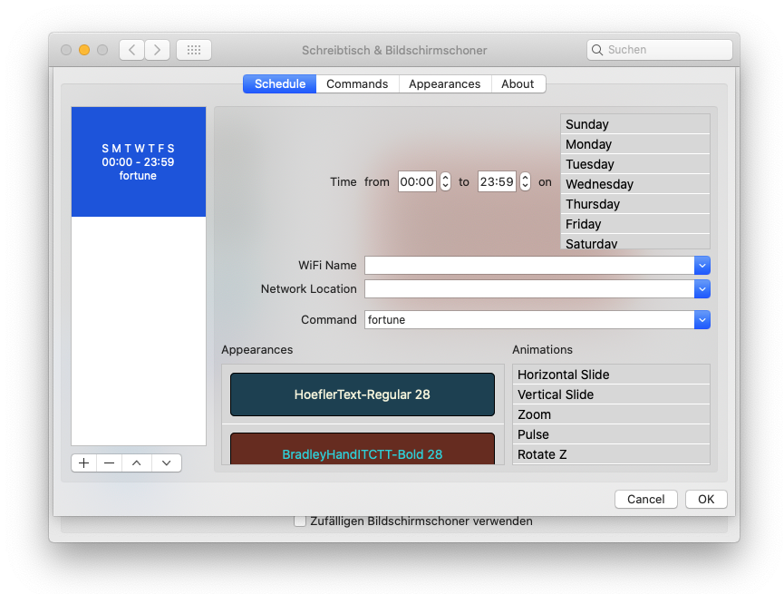

# Epigraver - a macOS Screensaver

Epigraver is a macOS screensaver that repeatedly calls some command line program or script specified by the user 
and displays the textual output of that script on the screen. The transition from one output to the next is animated 
using one of serveral animations.

Originally the screensaver was just meant to display the output from the 
[fortune](https://en.wikipedia.org/wiki/Fortune_%28Unix%29) program, but in its current iteration, it can call anything
that puts some text on stdout and then terminates.

## Installation
Head over to the [releases](../../releases) section and get the DMG of the current release. Those DMGs are always notarized 
and should work just fine on macOS Catalina. The DMG contains the screensaver bundle and double-clicking on it will 
install it. 

The screensaver is built with a minimum requirement of macOS Catalina (10.15.0). The only reason for this is that I don't 
have any running earlier macOS versions I could test it on. I'm not aware of any Catalina-specific code in the 
screensaver itself. If you need it to run on earlier versions, you might be successful in changing the requirement and 
building it yourself.

## Configuration
### Preparation
To make this screensaver display anything interesting other than the default "No command found", you need some command 
line program that generates texts. As it all started with **fortune**, let's assume that you want to use that. Unfortunately 
fortune isn't preinstalled on macOS, but it's pretty easy to install it via [Homebrew](https://brew.sh/). Run

```
brew install fortune
```

in your terminal application of choice. By default brew will install it in `usr/local/bin`. Be sure to note the full 
path to it if you made any adjustments to your Homebrew configuration. You'll need it in the next step.

### Commands
In the preference pane for screensavers open the preferences for Epigraver and there the **Commands** tab.


This is where you specify all the commands you want the screensaver to call.

The settings for each command are:
  * **Name:** The name for the command. This is what you'll see in the command list in the schedule configuration
  * **Command:** The command line to execute. zsh is used to execute it. You can just enter the full path to some 
    command line program here - like `/usr/local/bin/fortune` in this example - or anything else that would 
    work on a shell (e.g. `date`, `time`). Just like when you would run it in your terminal application, you can add 
    command line parameters to use here. To have a fortune command that only displays offensive entries you would enter
    `/usr/local/bin/fortune -o` here
  * **Animation Interval:** The interval at which the command is called again. Here it is called every 60 seconds.
  
The **Test** button executes the command once and displays the result in the preview below.

### Appearances
On the appearances tab you can configure the font, the foreground and background color used by the screensaver. There 
are already 5 sets preconfigured. You can change them and add additional ones.    


### Schedule
Until now you may have wondered why you can specify multiple commands and appearances. Enter the schedule.



The schedule enables you to specify when what commands with which appearances and animations are executed. Let's 
go through the available options from top to bottom

 * **Time:** Set the time range and weekdays for a schedule entry. Note that as a time range you can also specify 
   something like `19:00 - 06:00`. This would be a night entry that would be active from 7PM until 6AM on the next morning.
 * **WiFi Name:** You can - but do not need to - specify the name of a WiFi network this entry is to be active on. The 
   drop down menu contains the name of the current WiFi if you are currently using one. You can enter any name here 
   though. One possible use for this is to create distinct schedule entries for when you are at the office, at home or
   some public place like your favorite coffee shop.
 * **Network Location:** As with the previous, another way to have some kind of location awareness. The drop down menu 
   lists all network locations configured in the network preference pane. You can only choose from those because if it
   isn't configured there, it will never be active.
 * **Command:** The command to use for a schedule entry. The list contains the names of all commands configured on the 
   Commands tab.
 * **Appearances:** Choose one or more appearances to use. When the screensaver is started it selects one random 
   entry from your chosen appearances for the active schedule entry and uses that one for the whole run of the screensaver.  
 * **Animations:** There are several animations available for the transition from one output of the command to the next. 
   The names give a rough indication of the kind of animation, but the best way to get to know them is to choose 
   just one of them and then run the screensaver. 
   
When Epigraver is started, it looks through the list of schedule entries from top to bottom and takes the first that 
matches the current situation. It's a good idea to have one generic catch all entry at the bottom and more specific entries 
further up in the list. A command, one appearance and one animation are chosen at the start of the screensaver. Even
if another schedule entry would become active while the screensaver is running, it won't be chosen. The screensaver always
sticks with the configuration it selected at the start.   

### Building the screensaver yourself
To give an in depth explanation of how you can build something in Xcode and how you can create the needed certificates 
is out of scope for this Readme. Let's assume that you already know your ways in Xcode and get to some specifics for 
Epigraver. I use a shell script to build a release of the screensaver, bundle it in a DMG and notarize that DMG. The 
script is called [buildRelease.sh](buildRelease.sh). To run it you need

 * to have [create-dmg](https://github.com/create-dmg/create-dmg) installed. This is used to create the DMG
 * have the environment variable `EPIGRAVER_DMG_SIGNER` set to the name of the developer id certificate you also use 
   to build the screensaver. It would be better to extract it from the build logs, but I haven't tried to do that yet. So
   you need to set it explicitly here. It will be something of the form `Developer ID Application: YOUR NAME (YOURTEAMID)`.
   If that enviroment variable is not set the script will build the release of the screensaver and bundle it in an 
   unsigned DMG. This kind of DMG is fine if you just want to install the screensaver on the same computer the build is
   running
 * have the environment variable `EPIGRAVER_NOTARIZATION_ACCOUNT` set to the name of a generic password entry in the 
   keychain containing your developer apple id account name and an app specific password generated in the apple id portal.
   
   In [Customizing the Notarization Workflow](https://developer.apple.com/documentation/xcode/notarizing_macos_software_before_distribution/customizing_the_notarization_workflow)
   Apple describes a way to create a password in the keychain with `altool` and then reference that password with
   `@keychain:PASSWORD_ENTRY_NAME`. Unfortunately you can only access the password this way and not the username which
   is also present in that entry. And only `altool` can access that entry. The entry used for building Epigraver must be 
   created with `security add-generic-password -s PASSWORD_ENTRY_NAME -a DEVELOPER_APPLE_ID_E_MAIL -w DEVELOPER_APPLE_ID_APP_SPECIFIC_PASSWD`.
   
   Only if this variable is set, the DMG will be uploaded for notarization. The script then checks whether notarization
   is finished every 60 seconds and in case the notarization succeeds, it will saple the DMG. You then have a notarized DMG that can be 
   used to install the screensaver on any other macOS computer.
   
### Acknowledgements
The [DeveloperExcuses](https://github.com/kimar/DeveloperExcuses) and [Aerial](https://github.com/JohnCoates/Aerial) 
screensavers helped me to understand how things work with screensavers. 

As always, [stackoverflow](https://stackoverflow.com/) has been a source of needed advice and solutions to various challenges.  

